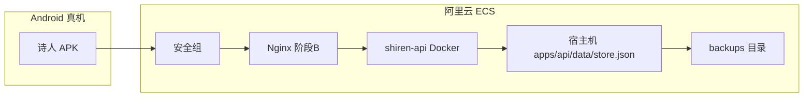

# 阿里云部署设计：真机 Android + 数据可迁移

**日期**：2026-05-22  
**状态**：已评审通过（用户确认「可以」）  
**范围**：家人自用；已有阿里云 ECS；云上从零数据；先 HTTP+IP，后 HTTPS+域名

---

## 1. 背景与目标

### 1.1 问题

- Android 真机安装 EAS 预览 APK 后报「连不上服务」，因未写入 `EXPO_PUBLIC_API_URL`，默认连 `http://10.0.2.2:3921`（仅模拟器有效）。
- 需要 API 部署在阿里云，家人手机长期使用。
- 未来可能更换 ECS，**文稿数据必须能完整迁出并导入新服务器**。

### 1.2 成功标准

1. 家人 Android 真机安装 APK 后，可正常写作、问问题、听写（权限见 Android 适配）。
2. 所有文稿仅存云端 `store.json`，换手机不丢稿。
3. 管理员能在约 30 分钟内完成换服务器：导出 `store.json` → 新 ECS 部署 → 手机恢复访问（阶段 A 含重打 APK；阶段 B 仅改 DNS 更快）。
4. 不引入数据库、不改 API 存储模型、不做 App 内填服务器地址（避免长辈误操作）。

### 1.3 非目标

- 多用户登录 / 鉴权
- App 内动态切换 API 地址
- 本阶段强制接入阿里云 OSS（列为可选增强）
- 飞书导出等未接功能

---

## 2. 约束与前提

| 项 | 选择 |
|----|------|
| 云资源 | 已有阿里云 ECS（或轻量应用服务器） |
| 数据起点 | 云上全新，无历史 `store.json` 迁移 |
| 访问方式 | 阶段 A：`http://公网IP:3921`；阶段 B：`https://api.域名` |
| 客户端 | Android 真机 + EAS 内测 APK |
| 密钥 | DeepSeek / ZenMux / DashScope 仍在手机「设置」SecureStore |

---

## 3. 架构



- **唯一持久化**：`apps/api/data/store.json`（`docker-compose.yml` volume 挂载）。
- **API 加载**：`apps/api/src/store/db.ts` → `hydrateStore()` / `persist()`。
- **手机连接**：构建时 bake `EXPO_PUBLIC_API_URL`（`apps/mobile/src/lib/config.ts`）。

---

## 4. 方案选型

采用 **方案 ①：ECS + Docker + 单文件备份**（与现有腾讯云文档一致）。

| 方案 | 结论 |
|------|------|
| ① Docker + store.json + scp/定时备份 | **采用** |
| ② + OSS 自动异地备份 | 可选增强，本阶段不强制 |
| ③ App 内配置 API 地址 | **不采用** |

---

## 5. 阶段 A：公网 IP + HTTP（先上线）

### 5.1 ECS 准备

- 系统：Ubuntu 22.04 / Debian 12（或现有系统）
- 软件：Docker、Docker Compose v2、git
- 安全组：入站 **TCP 3921**；建议仅放行家人常用公网 IP

### 5.2 部署步骤

```bash
git clone <仓库> shiren && cd shiren
cp .env.example .env
mkdir -p apps/api/data backups
docker compose up -d --build
curl http://127.0.0.1:3921/health   # ok: true
```

数据路径：`/path/to/shiren/apps/api/data/store.json`

### 5.3 手机连通性验证

1. 手机浏览器打开 `http://<ECS公网IP>:3921/health`
2. 通过后再安装 APK

### 5.4 Android APK 构建

```bash
cd apps/mobile
EXPO_PUBLIC_API_URL=http://<ECS公网IP>:3921 \
  npx eas-cli build --platform android --profile preview --non-interactive
```

**推荐**：在 EAS Project → Environment variables 为 `preview` / `production` 配置 `EXPO_PUBLIC_API_URL`，避免每次手打 IP。

### 5.5 阶段 A 局限

- 明文 HTTP；个别网络环境可能不稳定。
- ECS 公网 IP 变更需 **重打 APK**（除非提前进入阶段 B 使用域名）。

---

## 6. 阶段 B：域名 + HTTPS（后续升级）

### 6.1 前提

- 已备案域名，DNS A 记录指向 ECS 公网 IP

### 6.2 组件

- Nginx 反向代理 `127.0.0.1:3921`
- TLS：Let's Encrypt 或阿里云免费证书
- 对外 URL：`https://api.<域名>`

### 6.3 安全组调整

- 可关闭公网 **3921** 直连，仅开放 **443**
- API 仅经 Nginx 暴露

### 6.4 手机

- 重打 APK：`EXPO_PUBLIC_API_URL=https://api.<域名>`
- **换 ECS 时**：只改 DNS 到新 IP，**无需重打 APK**（相对阶段 A 的主要收益）

---

## 7. 数据备份与换服务器

### 7.1 数据形态

单文件 JSON，包含：`documents`、`revisions`、`chatSessions`、`chatMessages`、`writingAssistantMessages`。

### 7.2 日常备份（必做）

ECS crontab 每日拷贝：

```bash
0 3 * * * cp /path/to/shiren/apps/api/data/store.json \
  /path/to/shiren/backups/store-$(date +\%Y\%m\%d).json
```

可选：本机定期 `scp` 拉取一份冷备。

### 7.3 换服务器标准流程

| 步骤 | 操作 |
|------|------|
| 1 | 旧 ECS 停止写入（可选 `docker compose stop api`） |
| 2 | `scp user@旧IP:.../store.json ./store.json` |
| 3 | 新 ECS 同 5.2 部署，将 `store.json` 放入 `apps/api/data/` |
| 4 | `docker compose up -d`，验证 `/health` |
| 5a 阶段 A | 更新 `EXPO_PUBLIC_API_URL` 为新 IP，重打 APK |
| 5b 阶段 B | DNS 指向新 IP，手机无需重装 |
| 6 | App 内确认文稿、问问题记录完整 |

### 7.4 可选增强：OSS

- 每日 `store.json` 同步到阿里云 OSS Bucket
- 新 ECS 用 `ossutil` 拉回
- **本阶段不实现**；仅在运维文档中说明适用场景

---

## 8. 安全

当前 API **无登录**，依赖网络层：

1. 安全组限制 3921/443 来源 IP（家人公网 IP）
2. 密钥不写入 Git、不写入 `store.json`
3. 阶段 B 使用 HTTPS，降低中间人风险
4. 勿执行 `docker compose down -v`（当前 compose 未用命名卷，但避免误删数据目录）

---

## 9. 运维命令

```bash
cd shiren
docker compose logs -f api
docker compose restart api
docker compose up -d --build    # 更新代码，volume 保留
```

更新手机：EAS 重新 build（阶段 A 且 IP 变更时必做）。

---

## 10. 交付物（实施阶段）

| 交付 | 说明 |
|------|------|
| `docs/deploy-aliyun.md` | 阿里云分阶段部署、备份、换机、APK 构建 |
| EAS 环境变量 | `EXPO_PUBLIC_API_URL` 写入 preview/production |
| `eas.json` 或文档 | 注明构建前必须配置 API 地址 |
| README / AGENTS 链接 | 指向 deploy-aliyun.md |

**不改**：`apps/api` 存储逻辑、`db.ts` 结构、App 设置页（无服务器地址输入）。

---

## 11. 风险与缓解

| 风险 | 缓解 |
|------|------|
| IP 变更导致 App 连不上 | 阶段 B 域名；或 EAS 变量快速重打 APK |
| ECS 磁盘故障丢数据 | 每日 `backups/` + 定期 scp 到本机 |
| 公网暴露被扫端口 | IP 白名单 + 尽快 HTTPS |
| HTTP 被运营商干扰 | 推进阶段 B |

---

## 12. 与现有文档关系

- 逻辑复用 [deploy-tencent-cloud.md](../../deploy-tencent-cloud.md)，改为阿里云控制台用语（安全组、ECS、备案域名）。
- 移动端配置见 [apps/mobile/src/lib/config.ts](../../../apps/mobile/src/lib/config.ts)。
- Docker 定义见 [docker-compose.yml](../../../docker-compose.yml)。
