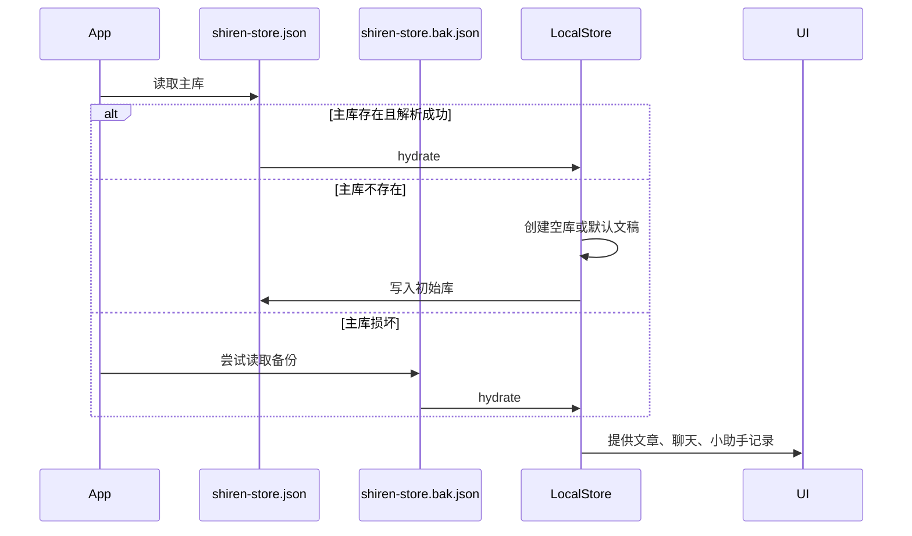
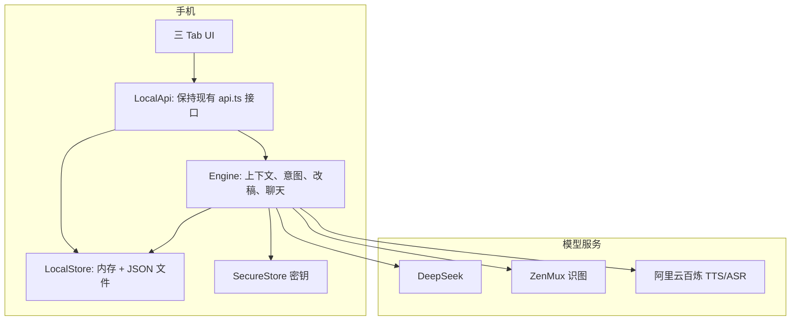

# 本地优先数据设计：手机存储 + 云模型直连

**日期**：2026-05-22  
**状态**：设计更新稿  
**范围**：把“诗人”从“手机瘦客户端 + 自建 API 存稿”调整为“手机本地存稿 + 直接访问模型服务”。  

---

## 1. 目标

### 1.1 用户目标

用户希望：

- 文章、历史版本、聊天记录、写作小助手记录都存在手机本地。
- 每次 App 启动时从本地读取一份完整数据包。
- 数据包可以导出，之后导入到另一台设备。
- 暂时不依赖自建后端；以后如果需要，再基于同一份数据格式做后端同步。

### 1.2 产品定位

本方案是 **Local-first（本地优先）**，不是完全离线。

- **本地优先**：文章和聊天记录只存在本机；断网仍可查看、编辑、导出、导入。
- **云模型直连**：AI 改稿、问问题、云端识图、云端听写仍需联网访问 DeepSeek / ZenMux / 阿里云百炼等模型服务。
- **不经过诗人自建服务器**：不再要求部署 `apps/api`，也不再用 `EXPO_PUBLIC_API_URL` 连接自建 API。

App 内需要明确告知：

> 文章和聊天记录只存在本机；AI 功能需要联网访问模型服务。

### 1.3 成功标准

1. 关闭自建 API 后，App 仍能启动并展示本地文章、历史版本、聊天记录。
2. 写作保存、新建文章、章节、历史版本、写作小助手消息、问问题消息都写入本机数据包。
3. 设置页可导出一份 `.shiren.json` 数据包。
4. 另一台设备可导入该数据包，恢复文章、历史版本、聊天记录和写作小助手记录。
5. 导出包不包含 DeepSeek / ZenMux / DashScope 等 API 密钥。
6. AI 功能仍可用，但只直连模型服务，不连接诗人自建 API。

---

## 2. 非目标

第一版不做：

- 多设备自动同步。
- 合并导入。
- 导出包加密。
- 手机完全离线 AI。
- 后端同步协议。
- 数据库迁移到 SQLite。
- App 内运行本地 HTTP 服务器。

这些能力可以后续在同一数据格式上扩展。

---

## 3. 数据包格式

### 3.1 主存储结构

主数据沿用当前服务端 `store.json` 的结构，减少迁移成本：

```ts
export interface PersistedStore {
  documents: Document[];
  revisions: Revision[];
  chatSessions: ChatSession[];
  chatMessages: Record<string, ChatMessage[]>;
  writingAssistantMessages: Record<string, WritingAssistantMessage[]>;
}
```

字段来源：

- `Document`、`Revision`、`ChatSession`、`ChatMessage`、`WritingAssistantMessage` 来自 `@shiren/shared`。
- 现有服务端定义位于 `apps/api/src/store/persist.ts`。
- 第一版应把 `PersistedStore` 移到共享包（例如 `packages/shared/src/persistedStore.ts`），避免前后端复制类型。

### 3.2 导出包结构

导出文件建议命名：

```text
诗人数据-YYYYMMDD-HHmm.shiren.json
```

文件内容：

```json
{
  "formatVersion": 1,
  "exportedAt": "2026-05-22T12:00:00.000Z",
  "appVersion": "1.0.0",
  "store": {
    "documents": [],
    "revisions": [],
    "chatSessions": [],
    "chatMessages": {},
    "writingAssistantMessages": {}
  }
}
```

### 3.3 不导出的内容

导出包 **不包含**：

- DeepSeek API Key。
- ZenMux API Key。
- DashScope API Key。
- 字号设置、朗读音色、普通话/粤语设置。
- 任何 SecureStore 中的配置。

导入到新设备后，用户需要在「设置」中重新填写密钥。

---

## 4. 本地存储策略

### 4.1 文件位置

手机端主库：

```text
FileSystem.documentDirectory/shiren-store.json
```

备份文件：

```text
FileSystem.documentDirectory/shiren-store.bak.json
```

临时写入文件：

```text
FileSystem.documentDirectory/shiren-store.tmp.json
```

### 4.2 启动加载

启动流程：



### 4.3 写入策略

所有数据变更走统一 `LocalStore`：

1. 更新内存状态。
2. 触发防抖保存（建议 300–500ms）。
3. 保存时先把当前主库复制为 `.bak`。
4. 写入 `.tmp`。
5. 校验 `.tmp` 可解析。
6. 用 `.tmp` 覆盖主库。

这样可以降低 App 崩溃、电量耗尽或写入中断造成主库损坏的风险。

### 4.4 数据损坏处理

启动时：

- 主库可读：正常进入。
- 主库损坏、备份可读：恢复备份，并提示“已从备份恢复数据”。
- 主库和备份都损坏：进入空库，并保留损坏文件用于后续排查（不自动删除）。

---

## 5. LocalApi 与 Engine

### 5.1 总体架构



### 5.2 LocalApi

`LocalApi` 对外保持当前 `apps/mobile/src/lib/api.ts` 的主要方法形状：

- `listDocuments`
- `createDocument`
- `getDocument`
- `updateDocument`
- `addChapter`
- `listRevisions`
- `acceptRevision`
- `rejectRevision`
- `rollback`
- `listChatSessions`
- `createChatSession`
- `getChatMessages`
- `sendChatMessage`
- `getWritingAssistantMessages`
- `analyzeWritingAssistantIntent`
- `confirmWritingAssistant`

UI 层尽量只从 HTTP `api` 切换到本地 `api` 实现，减少大面积重写。

### 5.3 Engine

不要把 `apps/api` 的核心逻辑直接复制进 `apps/mobile`。推荐抽出共享包：

```text
packages/engine
```

职责：

- 上下文组装。
- 上下文预算与预览。
- 写作小助手 intent 分析。
- 写作小助手 confirm 后生成 revision。
- 问问题消息组装与模型调用。
- 聊天标题生成。
- 需要时做上下文压缩。

`packages/engine` 依赖：

- `@shiren/shared`
- 模型客户端抽象接口
- `PersistedStore` 访问接口

`packages/engine` 不依赖：

- Hono。
- React Native UI。
- 文件系统。
- SecureStore。

这样以后如果恢复后端，可以让 `apps/api` 和 `apps/mobile` 共用同一套业务编排，避免本地版和云端版分叉。

### 5.4 模型客户端

手机端模型客户端从 SecureStore 读取密钥：

- DeepSeek：写作改稿、问问题、意图识别。
- ZenMux：云端识图（可选；本机 OCR 仍保留）。
- DashScope：云端 TTS / ASR（可选）。

错误文案需要区分：

- 密钥未配置。
- 手机无网络。
- 模型服务不可用。
- 模型超时。

不再出现“连不上诗人服务器”。

---

## 6. 导出与导入

### 6.1 设置页入口

设置页新增“本地数据”区：

- 当前模式：本地存储。
- 本地数据大小。
- 上次保存时间。
- 导出数据。
- 导入数据。

### 6.2 导出流程

1. 从 `LocalStore` 读取当前完整 `PersistedStore`。
2. 包装为 `ShirenExportBundle`。
3. 写入临时导出文件。
4. 调用系统分享面板（微信文件、系统文件、AirDrop 等）。

导出失败时只提示文件导出失败，不影响主库。

### 6.3 导入流程

第一版采用 **整包替换**，不做合并导入。

流程：

1. 用户选择 `.shiren.json` 文件。
2. 校验 JSON 结构和 `formatVersion`。
3. 弹窗二次确认：

   > 导入后会替换本机现有文章和聊天记录。当前数据会先自动备份。

4. 备份当前 `shiren-store.json`。
5. 替换为导入包中的 `store`。
6. 重新 hydrate `LocalStore`。
7. 刷新写作、问问题、设置页面。

### 6.4 导入失败处理

- 文件无法读取：提示“文件打不开”。
- JSON 不合法：提示“这不是诗人数据包”。
- `formatVersion` 不支持：提示“数据包版本太新，请升级 App 后再导入”。
- 替换失败：恢复导入前备份。

---

## 7. 错误文案调整

本地模式不再使用“服务器连接”作为核心状态。

### 7.1 删除或降级的概念

- `EXPO_PUBLIC_API_URL`
- 自建 API 健康检查
- “连不上诗人服务器”
- 全局服务器离线条

这些可以保留在未来“云端模式”中，但本地模式默认不展示。

### 7.2 新错误类型

| 类型 | 示例文案 |
|------|----------|
| 本地读取失败 | 本地数据读取失败，已尝试使用备份恢复 |
| 本地保存失败 | 本地保存失败，请确认手机存储空间充足 |
| 导出失败 | 数据包导出失败，请稍后再试 |
| 导入失败 | 这不是有效的诗人数据包 |
| AI 网络失败 | AI 模型暂时连不上，请检查网络后再试 |
| 密钥缺失 | 请先在设置里填写小助手密钥 |

### 7.3 设置页说明

设置页应展示：

> 文章和聊天记录只存在本机。AI 改稿、问问题、云端识图和云端听写需要联网访问模型服务。

---

## 8. 与现有后端的关系

现有 `apps/api` 暂时保留，但本地模式默认不依赖它。

### 8.1 后端代码保留理由

- 未来可作为“云同步”或“家庭服务器版”基础。
- 当前很多逻辑可作为抽取 `packages/engine` 的来源。
- 现有 `store.json` 格式可以作为导入导出兼容格式。

### 8.2 未来后端预留

未来如果要做后端同步，建议基于本地包格式：

```ts
interface SyncProvider {
  pull(): Promise<PersistedStore>;
  push(store: PersistedStore): Promise<void>;
}
```

第一版不做冲突合并。未来可以先做“手动上传 / 手动下载”，再做自动同步。

---

## 9. 实施边界

### 9.1 第一阶段

- 共享 `PersistedStore` 类型。
- 实现 `LocalStore` 文件读写、备份、原子保存。
- 实现 `LocalApi` 覆盖文章、章节、revision、聊天、小助手消息的本地 CRUD。
- 抽出或迁移最小可用 `Engine`，让写作改稿和问问题可直接访问 DeepSeek。
- 设置页增加本地数据状态、导出、导入。
- 文案从“服务器连接”调整为“本地数据 + AI 模型网络”。

### 9.2 第二阶段

- 抽完整上下文预览、压缩、预算逻辑到 `packages/engine`。
- 支持从旧服务端 `store.json` 导入到本地模式。
- 增加导入包版本迁移。

### 9.3 第三阶段

- 可选后端同步。
- 可选 OSS / iCloud / Android 文件备份说明。
- 可选导出包加密。

---

## 10. 风险与缓解

| 风险 | 缓解 |
|------|------|
| 单文件损坏 | 主库 + 备份 + 临时文件原子写入 |
| App 与后端逻辑分叉 | 抽 `packages/engine`，避免复制业务流程 |
| 大文稿保存慢 | 防抖保存；必要时后续分文件 |
| 用户误以为完全离线 | 明确“AI 需要联网访问模型服务” |
| 换设备后 AI 不能用 | 导出包不含密钥；导入后提示重新填写密钥 |
| 导入覆盖误操作 | 导入前自动备份 + 二次确认 |

---

## 11. 设计决策

1. 采用 **Local-first**，不承诺完全离线 AI。
2. 存储格式沿用 `PersistedStore`，保持与当前服务端 `store.json` 兼容。
3. 第一版导入采用整包替换，不做合并。
4. 导出包不包含任何 API 密钥。
5. AI 编排逻辑抽为共享 `packages/engine`，避免本地版与后端版分叉。
6. 本地模式默认不展示服务器连接状态。

