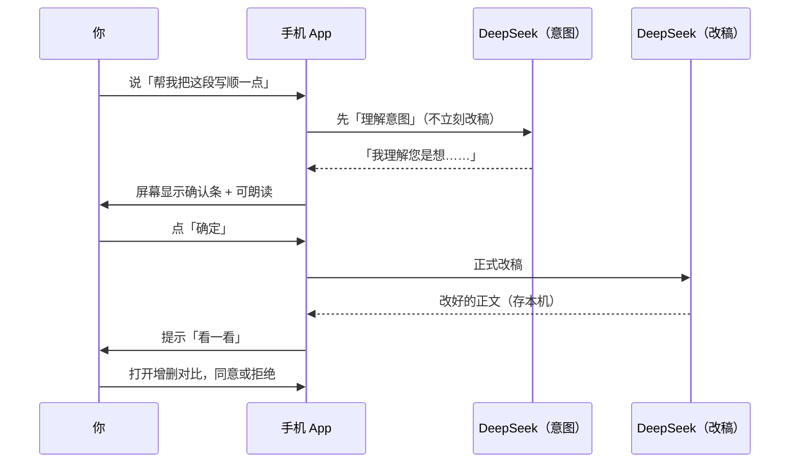

# 诗人 — 项目介绍（给家人用的写作 App）

本文说明：**这个 App 是干什么的、能解决什么问题、平时怎么用、背后怎么实现、数据存在哪**。给产品负责人 / 家人看，不必会编程。

---

## 一、为什么要做「诗人」

很多长辈想**把自己的经历写成文章**（回忆录、随笔、给儿孙留的话），但会遇到这些困难：

| 困难 | 诗人怎么帮 |
|------|------------|
| 字打不快、不会排版 | 大字号写作区，可**按住说话**转成文字 |
| 不知道怎么改、怕改坏 | **小助手**按你的话润色/续写，改之前先**说清楚你要什么** |
| 改完看不清改了啥 | **绿增灰删对比**，接受前能「看一看」 |
| 改错了想回去 | **历史版本**按时间列出来，可**回滚** |
| 想问生活/健康问题，又怕打扰子女 | 单独的 **「问问题」**，和小助手改稿分开 |
| 眼睛累 | **朗读**正文、朗读小助手回复；可调**文章字号 / 对话字号** |
| 怕字丢 | 内容存在**手机本机**，可**导出数据包**备份；换手机导入即可 |

定位：**家人单机、中文、适老、写作与聊天分离**，不是公开社交或协作办公。

---

## 二、App 里三大块（底部三个 Tab）

### 1. 写作

这是**主战场**：写长文、改长文。

**你能做的事：**

- 一篇篇文章（多文稿），每篇可有多**章节**（像分章写回忆录）。
- 顶部工具栏：**复制文字**、**生成分享长图**、**新建文章**（进文稿库选或新建）、**开始朗读**。
- 第二行是**整篇文章题目**（可改题目）、**历史版本**。
- 第三行切换**章节**、添加章节。
- 中间大区域：**正文输入**（字号跟「设置 → 文章字号」走）。
- 右下角 **写作小助手**：用说话或打字告诉它「怎么改」——润色、续写、扩写等。

**小助手改稿的典型过程：**



- **看一看**：左右对比「改了什么」（绿色新增、灰色删除），可再改字，再点**同意**写进文章。
- **历史版本**：以前每次同意过的版本都能查，可**回到某一版**。

**其它写作相关能力：**

- **识图识字**：拍照/相册 → 文字插入本章或新文稿（可选 ZenMux 云端识图）。
- **再改一版**：某一版不满意，在看一看里说明，小助手在上一版基础上再改。
- **隐藏文章**：不删，只在写作列表藏起来，设置里可复原。

---

### 2. 问问题

和写作**完全分开**的一个聊天界面，适合：

- 问健康、生活、常识（不直接改正文）。
- **选图片**发上去（需配置 ZenMux 密钥，与问问题回答同一项），让模型看图回答。
- 可切换**往期话题**、**开始新话题**。
- 发之前也会**先确认**「您是想问……」再真正发送（和写作小助手同一套交互习惯）。
- 可**朗读**小助手的回复。

字号跟「设置 → **对话字号**」走；小助手气泡、意图确认条都算「对话」。

---

### 3. 设置

- **本地数据**：查看路径、**导出/导入**备份包（换手机用）。
- **密钥**：DeepSeek（问问题/写作**意图**、写作**改稿**、侧栏聊天）、ZenMux（问问题**回答**、**带图问问题**、云端识图）、阿里云百炼（可选，更好听的朗读与听写）。
- **普通话 / 粤语**：影响小助手**回复用语**、朗读、按住说话识别；粤语里称呼用「姐姐」。
- **朗读声音**：可选不同音色。
- **文章字号 / 对话字号**：小 / 中 / 大 / 特大 四档，默认「大」。

---

## 三、背后怎么实现（不用记命令，懂个大概即可）

### 3.1 整体架构（默认：本地优先）

```text
┌─────────────────────────────────────┐
│           家人的手机                 │
│  Expo App · shiren-store.json       │
│  设置里填 DeepSeek（写作/问问题）+ ZenMux + 百炼 │
└─────────────────┬───────────────────┘
                  │ HTTPS（Wi‑Fi / 4G）
                  ▼
        DeepSeek / 阿里云百炼 / ZenMux
        （不经「诗人」自家服务器）
```

- **文章、版本、问问题记录、小助手记录**都在手机里的 `shiren-store.json`。
- 每写一个字、每聊一句，**立刻写入本机**；不怕没网时丢稿（已保存的部分仍在）。
- **换手机**：设置 → **本地数据** → 导出 `.shiren.json`，新手机导入。
- **可选 legacy**：若仍用腾讯云跑 API、多台手机共一份 `store.json`，见 [deploy-tencent-cloud.md](./deploy-tencent-cloud.md)（与本地优先是两套路径，不要混用）。

产品说明与技术对照：[local-first-data.md](./local-first-data.md) · [local-vs-cloud.md](./local-vs-cloud.md)

### 3.2 技术栈（给懂技术的人看）

| 部分 | 技术 |
|------|------|
| 手机 | React Native + Expo 54 |
| 服务端 | Node.js + Hono |
| 共享逻辑 | TypeScript 包 `@shiren/shared`（类型、对比算法、提示词） |
| AI 路由 | DeepSeek Pro：问问题/写作意图、改稿、侧栏聊天；ZenMux Gemini：问问题回答；ZenMux Opus：带图问问题 |
| 朗读 | 手机系统 TTS 或阿里云 Qwen3-TTS |
| 听写 | 手机自带或云端 ASR |

### 3.3 「意图确认」为什么要有

老人说话常含糊，例如「帮我弄一下这段」。若直接改稿，容易改错。

所以设计成**两步**：

1. **理解**：模型先输出「我理解您是想……」——你确认或取消。
2. **执行**：确认后才改稿或发送聊天。

问问题、写作小助手都是这个逻辑（产品上的「说反了」问题已按此统一）。

### 3.4 上下文很长怎么办

文章、聊天记录特别长时，不能无限塞进模型。完整版（自建 API 时）会显示**圆环百分比**、自动压缩、手动编排上下文。

**当前手机默认版**为简化：上下文环入口已隐藏，压缩为占位提示；意图整理与改稿主路径已对齐云端 prompt。后续 roadmap 见 [local-first-data.md](./local-first-data.md#上下文编排-roadmap)。

### 3.5 朗读与等待提示

- 小助手开始想时：会念短句如「等我一阵，我思考下」（粤语）或普通话 equivalent。
- 想很久（超过约 28 秒）：界面换长句「你写得真长，等我多想想…」，并**再次朗读**这句，避免老人以为卡死了。
- 回复到了：提示音 + 可朗读全文（问问题页有「开始朗读」按钮）。

---

## 四、能力清单（对照表）

| 能力 | 写作 | 问问题 | 说明 |
|------|:----:|:------:|------|
| 多篇文章 / 章节 | ✓ | — | 文稿库管理 |
| 按住说话 | ✓ | ✓ | 微信式输入栏 |
| 意图确认再发送 | ✓ | ✓ | |
| 润色 / 续写 / 扩写 / 改语气 | ✓ | — | 通过小助手 |
| 增删对比 + 看一看 | ✓ | — | |
| 历史版本 / 回滚 | ✓ | — | |
| 自由聊天 | — | ✓ | |
| 发图片提问 | — | ✓ | 需 ZenMux（与问问题回答同一密钥） |
| 识图插入正文 | ✓ | — | OCR |
| 分享长图 / 复制 | ✓ | — | |
| 朗读 | ✓ | ✓ | |
| 普通话 / 粤语 | ✓ | ✓ | 设置里选 |
| 字号两档独立调节 | ✓ | ✓ | 文章 vs 对话 |
| 上下文占用查看 | — | — | 本地版暂隐藏；legacy API 版有 |
| 飞书导出 | — | — | 尚未做 |

---

## 五、数据安全与备份（家人必知）

| 问题 | 答案 |
|------|------|
| 数据存在哪？ | **手机**里的 `shiren-store.json`（应用私有目录） |
| 换手机会丢吗？ | 不导出会丢；请用 **设置 → 本地数据 → 导出** 再在新手机导入 |
| 更新 App 会丢吗？ | 一般不丢（同机覆盖安装） |
| 什么情况下会丢？ | 卸载 App、清数据、换机未导入 |
| 怎么备份？ | 定期导出 `诗人数据-*.shiren.json` 到微信/网盘/U 盘 |
| 密钥安全吗？ | 密钥在**手机**；导出包**不含**密钥，勿把导出包发给陌生人 |

---

## 六、你现在该怎么用（推荐）

1. 安装 App（内测 APK 或开发包），**不必**先搭服务器。
2. **设置**里填 **DeepSeek**（写作/问问题意图、改稿、侧栏聊天，必填）与 **ZenMux**（问问题回答、带图、云端识图，必填）、百炼（可选，更好听的朗读与听写）。
3. 每周 **设置 → 本地数据 → 导出** 一次备份。
4. 换手机：新手机安装 App → 导入同一份 `.shiren.json` → 重新填密钥。

若坚持「多台手机共一份云端稿库」，再按 [deploy-tencent-cloud.md](./deploy-tencent-cloud.md) 部署 legacy API（与本地优先不要混用两套数据）。

---

## 七、和 README 的关系

- [README.md](../README.md)：怎么启动、端口、密钥、Docker 命令。
- **本文**：产品是什么、解决什么、怎么用、原理与数据。
- [AGENTS.md](./AGENTS.md)：给以后改代码的 AI/程序员看的历史与禁忌。

---

## 八、后续可扩展（当前没做）

- 飞书 / Word 导出  
- App 内一键云备份（目前靠服务器文件备份即可）  
- 多家人账号与权限  
- 离线写作再同步  

若你只服务**一位家人、一部手机为主**，本地优先已匹配：**即写即存本机，导出包即备份**。
